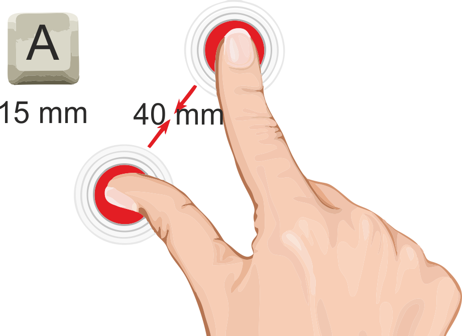

## Deadly Ninja Throw

This game demonstrates the application of the gesture of mixins. The aim of the game is to get a [shuriken](https://en.wikipedia.org/wiki/Shuriken) at the target.
<p align="center">
  
</p><br>

### Discussion: What can go wrong, and how to deal with it?
When you use gesture mixins in your applications you may have some difficulties that make it difficult to call
 callbacks/events because of which they may not trigger immediately or not be called at all.
 In this discussion, I want to describe the main reasons for the incorrect work of mixins.
 
### Size matters
The most common reason is that the element size is too small. 

<p align="center">
  
</p>

When developing mobile applications, make sure that the element in which you are using the gesture-mixins has a large enough 
size to ensure comfortable operation with at least two fingers. This is especially actual for
[`Pinch-gesture mixin`](https://github.com/Halochkin/Components/tree/master/Gestures/PinchGestureMixin).  
If the element is too small to make gestures on its area and one finger is outside its borders, it will be equal to using only 
one finger and the `pinchCallback/event` will not trigger.<br>
If you can't increase the size of the element but you need to add a mixin 
gesture for it you can add a callback/event to the parent element.
### Your item is too responsive or not responsive enough
Quite often, when using gestures, you can activate the browser's built-in gestures (which are used to navigate the page, zoom in and out of scrolling and other browser control functions) at the same time as a call/event that will call for unnecessary changes to the field of view.
####  Why this happens and how to fix it?
This problem will occur every time the largest item size is larger than the device display size.<br>
You can solve this problem in 3 ways
### 1. Using `touch-action:` CSS property
The `touch-action` CSS property determines whether touch input MAY trigger default behavior supplied by user agent. This includes, but is not limited to, behaviors such as panning or zooming. 
The result of touching an element depends on the value of the touch-action property and the standard settings for touching the element and its ancestors. You can selectively disable the standard touch behavior, thus preventing sending if the behavior is not required.<br>
Also, using `touch-action`, you can remove the delay of 300ms before activating single taps of links and buttons. The delay is set in the default browser to check that the user has really tapped just once. However, this behavior makes the site less responsive. If you set touch-action in the manipulation, any touch of the element will only trigger panning or zoom. Double-click gestures will be ignored, single presses will be executed without delay.<br>
##### `touch-action` values
**`none`** no default touch behaviors are permitted on the element.<br>
If you don't want to allow the necessary standard behaviors on an element, such as:<br>
**`pan-x`** allowed panning with the fingers of the x-axis Can be combined with pan-y, pan up, pan down and zoom with your fingers. <br>
**`pan-y`** allowed panning with your fingers for the y-axis Can be combined with pan-x, pan up, pan down and zoom with your fingers. <br>
**`pan-left`** touch-driven panning is permitted only if the action starts by panning to the left. This means the user is dragging their finger to the right. Once scrolling has started, the direction can then be reversed.<br>
**`pan-right`** touch-driven panning is permitted only if the action starts by panning to the right. This means the user is dragging their finger to the left. Once scrolling has started, the direction can then be reversed.<br>
**`pan-up`** touch-driven panning is permitted only if the action starts by panning up. This means the user is dragging their finger downwards. Once scrolling has started, the direction can then be reversed.<br>
**`pan-down`** touch-driven panning is permitted only if the action starts by panning down. This means the user is dragging their finger upwards. Once scrolling has started, the direction can then be reversed.<br>
**`pinch-zoom`** touch-driven zooming with multiple-fingers is permitted. Can be combined with pan-x, pan-left or pan-right; and pan-y pan-up or pan-down. <br>
### 2. Using the viewport meta tag to control layout on mobile browsers
A typical mobile-optimized site contains something like the following:
```html
<meta name="viewport" content="width=device-width, initial-scale=1">
```
The width property controls the size of the viewport. It can be set to a specific number of pixels like `width=600` or to the special value device-width, which is the width of the screen in CSS pixels at a scale of 100%. (There are corresponding height and device-height values, which may be useful for pages with elements that change size or position based on the viewport height.)
The initial-scale property controls the zoom level when the page is first loaded. The maximum-scale, minimum-scale, and user-scalable properties control how users are allowed to zoom the page in or out.

#### Example
```html
<parent-element>
       <child-element></child-element>
</parent-element>
```
```javascript
import {PinchGesture} from "https://rawgit.com/Halochkin/Components/master/Gestures/PinchGestureMixin/src/PinchMixin.js";
import {DragFlingGesture} from 'https://rawgit.com/Halochkin/Components/master/Gestures/DragFlingMixin/src/DragFlingGestureMixin.js';
class Parent extends PinchGesture(HTMLElement){
  
  spinCallback(detail){                                     //[1]
    let child = document.querySelector("child-element");
    child.style.transform = `rotate(${detail.rotation}deg`;
  }
}
class Child extends DragFlingGesture(HTMLElement){
  
    constructor(){
      super();
      this.style.position = "absolute";
    }
    
    draggingCallback(detail){
     this.style.left = (parseFloat(this.style.left) + detail.distX) + "px";
     this.style.top = (parseFloat(this.style.top) + detail.distY) + "px";
    }
}
  customElements.define("parent-element", Parent);
  customElements.define("child-element", Child);
```
[1]  `spin` gesture will be triggered outside the child element. This will significantly increase the area to activate the event.
[2]   since two fingers are not required for `drag` event, it means that it can be called directly from the element.<br>
This example demonstrates how you can use a mixin outside of an element.


#### References
1. [Viewport meta tag](https://developer.mozilla.org/en-US/docs/Mozilla/Mobile/Viewport_meta_tag)
2. [`touch-action` property](https://developer.mozilla.org/ru/docs/Web/CSS/touch-action)
